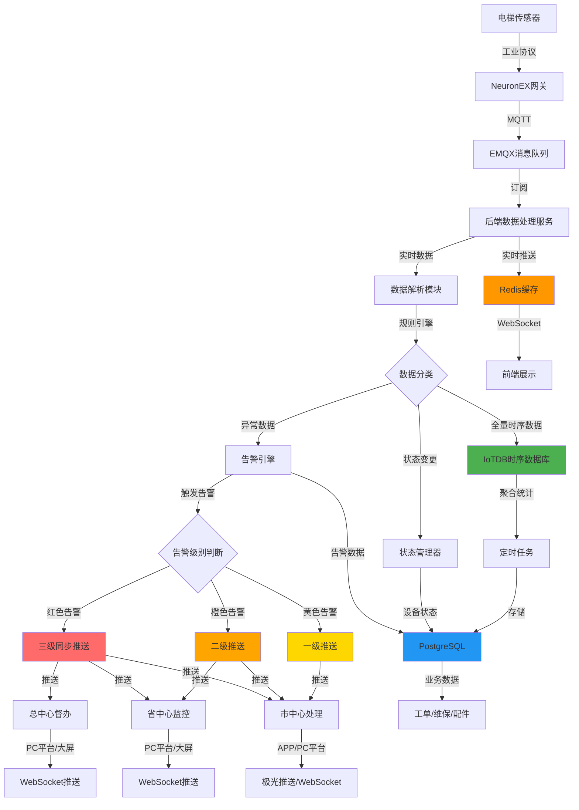
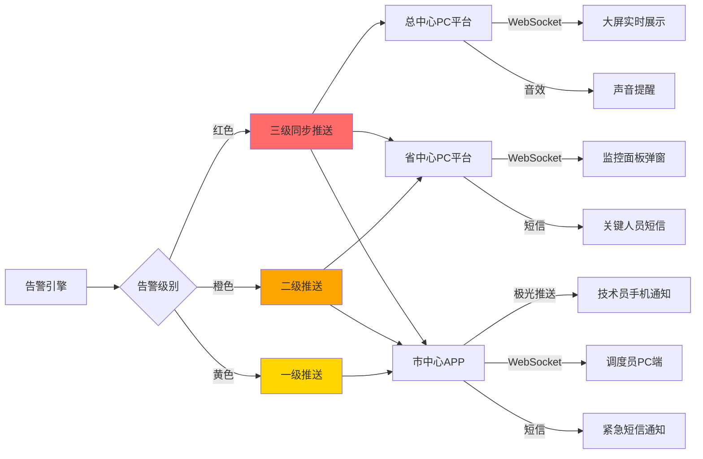
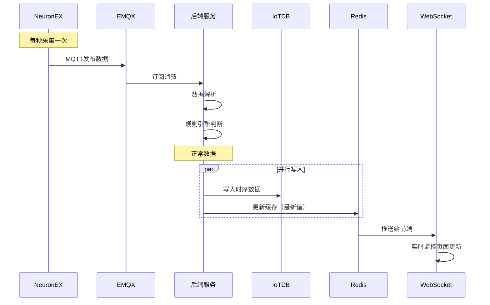
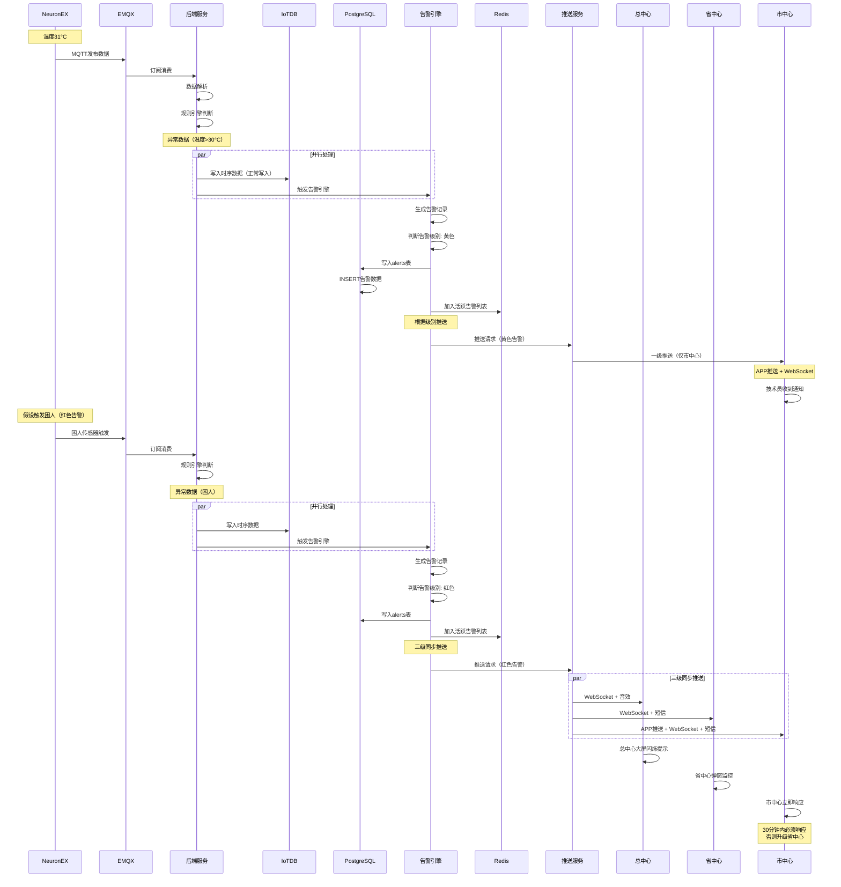
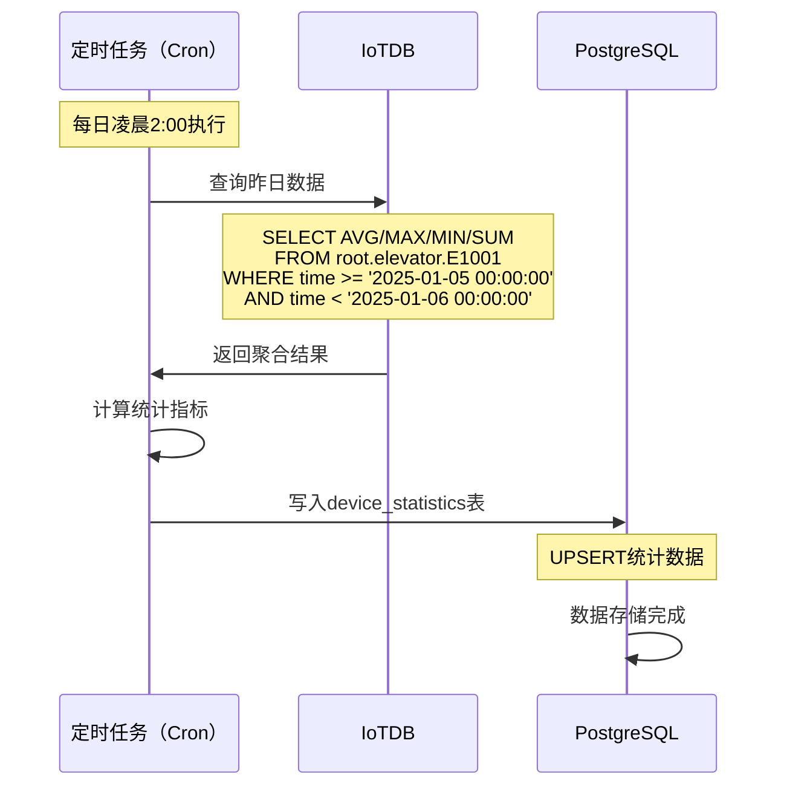

# 电梯运维平台 - 数据分层存储架构设计

> **核心问题**: 实时数据、告警数据、业务数据应该如何存储？  
> **技术栈**: NeuronEX + EMQX + IoTDB + PostgreSQL  

---

## 一、推荐方案：分层存储架构 ⭐

### 1.1 架构设计原则

```
存储分层原则：
├── 时序数据 → IoTDB（高频写入、时序查询）
├── 业务数据 → PostgreSQL（关系查询、事务处理）
└── 缓存数据 → Redis（实时状态、热数据）
```

### 1.2 完整数据流架构图（含告警推送）



---

## 二、详细存储策略

### 2.0 告警推送机制详解

#### 2.0.1 三级推送架构



#### 2.0.2 推送渠道说明

| 推送渠道 | 适用场景 | 优先级 | 到达率 |
|---------|---------|--------|--------|
| **极光推送** | 市中心技术员APP | 高 | 98%+ |
| **WebSocket** | PC端实时监控 | 高 | 99%+ |
| **短信** | 红色告警备用渠道 | 中 | 99%+ |
| **邮件** | 日报、周报 | 低 | 95%+ |
| **语音电话** | 极端紧急情况 | 最高 | 100% |

#### 2.0.3 推送代码实现

```java
@Service
public class AlertPushService {
    
    @Autowired
    private WebSocketServer webSocketServer;
    
    @Autowired
    private JPushClient jpushClient;
    
    @Autowired
    private SmsService smsService;
    
    /**
     * 根据告警级别推送通知
     */
    public void pushAlertNotification(Alert alert) {
        switch (alert.getLevel()) {
            case "red":
                // 红色告警：三级同步推送
                pushToNationalCenter(alert);  // 总中心
                pushToProvinceCenter(alert);  // 省中心
                pushToCityCenter(alert);      // 市中心
                break;
                
            case "orange":
                // 橙色告警：二级推送
                pushToProvinceCenter(alert);
                pushToCityCenter(alert);
                break;
                
            case "yellow":
                // 黄色告警：一级推送
                pushToCityCenter(alert);
                break;
        }
    }
    
    /**
     * 推送给总中心（督办通知）
     */
    private void pushToNationalCenter(Alert alert) {
        // WebSocket推送到PC端
        webSocketServer.sendToRole("national_admin", 
            AlertMessage.builder()
                .type("critical_alert")
                .level("red")
                .content(alert.getDesc())
                .deviceId(alert.getDeviceId())
                .location(alert.getLocation())
                .build()
        );
        
        // 大屏音效提醒
        webSocketServer.sendToScreen("national_screen", 
            ScreenAlert.builder()
                .sound("critical_alert.mp3")
                .flash(true)
                .build()
        );
    }
    
    /**
     * 推送给省中心（监控通知）
     */
    private void pushToProvinceCenter(Alert alert) {
        // WebSocket推送（弹窗提醒）
        webSocketServer.sendToRegion(alert.getProvince(),
            AlertMessage.builder()
                .type("alert_monitor")
                .level(alert.getLevel())
                .content(alert.getDesc())
                .deviceId(alert.getDeviceId())
                .location(alert.getLocation())
                .requireResponse(alert.getLevel().equals("red"))
                .build()
        );
        
        // 红色告警发送短信给省中心负责人
        if ("red".equals(alert.getLevel())) {
            List<String> phones = getProvinceManagerPhones(alert.getProvince());
            smsService.sendBatch(phones, 
                String.format("【紧急】%s发生困人告警，请立即关注处理进度！", 
                    alert.getLocation())
            );
        }
    }
    
    /**
     * 推送给市中心（处理通知）
     */
    private void pushToCityCenter(Alert alert) {
        // 1. APP推送给市内所有技术员
        List<String> technicianIds = getTechniciansByCity(
            alert.getProvince(), 
            alert.getCity()
        );
        
        jpushClient.sendToUsers(technicianIds,
            PushNotification.builder()
                .title(getAlertTitle(alert.getLevel()))
                .content(String.format("%s - %s", 
                    alert.getLocation(), 
                    alert.getDesc()))
                .extras(Map.of(
                    "alert_id", alert.getAlertId(),
                    "device_id", alert.getDeviceId(),
                    "alert_level", alert.getLevel(),
                    "action", "open_alert_detail"
                ))
                .sound(getAlertSound(alert.getLevel()))
                .priority(getAlertPriority(alert.getLevel()))
                .build()
        );
        
        // 2. WebSocket推送给调度员PC端
        webSocketServer.sendToCity(alert.getProvince(), alert.getCity(),
            AlertMessage.builder()
                .type("alert_process")
                .level(alert.getLevel())
                .content(alert.getDesc())
                .deviceId(alert.getDeviceId())
                .location(alert.getLocation())
                .suggestAction(getSuggestAction(alert))
                .build()
        );
        
        // 3. 红色告警立即发送短信
        if ("red".equals(alert.getLevel())) {
            smsService.sendToNearestTechnicians(
                alert.getLocation(),
                3,  // 最近的3个技术员
                String.format("【紧急困人】%s，请立即前往处理！", 
                    alert.getLocation())
            );
        }
    }
    
    /**
     * 获取告警标题
     */
    private String getAlertTitle(String level) {
        switch (level) {
            case "red": return "🔴 紧急告警";
            case "orange": return "🟠 重要告警";
            case "yellow": return "🟡 一般告警";
            default: return "告警通知";
        }
    }
    
    /**
     * 获取告警声音
     */
    private String getAlertSound(String level) {
        switch (level) {
            case "red": return "emergency.mp3";      // 急促警报声
            case "orange": return "important.mp3";   // 提示音
            case "yellow": return "normal.mp3";      // 普通提示音
            default: return "default.mp3";
        }
    }
    
    /**
     * 获取推送优先级
     */
    private int getAlertPriority(String level) {
        switch (level) {
            case "red": return 10;      // 最高优先级
            case "orange": return 7;    // 高优先级
            case "yellow": return 5;    // 普通优先级
            default: return 3;
        }
    }
}
```

#### 2.0.4 推送失败重试机制

```java
@Component
public class AlertPushRetryHandler {
    
    @Autowired
    private AlertPushService pushService;
    
    @Autowired
    private RedisTemplate redisTemplate;
    
    /**
     * 推送失败后加入重试队列
     */
    public void addToRetryQueue(Alert alert, String channel, String target) {
        RetryTask task = RetryTask.builder()
            .alertId(alert.getAlertId())
            .channel(channel)
            .target(target)
            .retryCount(0)
            .maxRetries(3)
            .nextRetryTime(System.currentTimeMillis() + 60000)  // 1分钟后重试
            .build();
        
        redisTemplate.opsForList().rightPush("alert:retry:queue", task);
    }
    
    /**
     * 定时扫描重试队列
     */
    @Scheduled(fixedRate = 30000)  // 每30秒执行一次
    public void processRetryQueue() {
        List<RetryTask> tasks = redisTemplate.opsForList()
            .range("alert:retry:queue", 0, -1);
        
        long now = System.currentTimeMillis();
        
        for (RetryTask task : tasks) {
            if (now >= task.getNextRetryTime()) {
                try {
                    // 重新推送
                    pushService.retryPush(task);
                    
                    // 推送成功，移除任务
                    redisTemplate.opsForList().remove("alert:retry:queue", 1, task);
                    
                } catch (Exception e) {
                    // 推送失败，更新重试次数
                    task.setRetryCount(task.getRetryCount() + 1);
                    
                    if (task.getRetryCount() >= task.getMaxRetries()) {
                        // 超过最大重试次数，记录失败日志
                        logPushFailure(task);
                        redisTemplate.opsForList().remove("alert:retry:queue", 1, task);
                    } else {
                        // 继续重试，延长重试时间
                        task.setNextRetryTime(now + 120000);  // 2分钟后重试
                    }
                }
            }
        }
    }
}
```

#### 2.0.5 推送统计与监控

```java
@Service
public class AlertPushStatistics {
    
    @Autowired
    private InfluxDBTemplate influxDB;
    
    /**
     * 记录推送统计数据
     */
    public void recordPushMetrics(String channel, String level, boolean success) {
        Point point = Point.measurement("alert_push_metrics")
            .time(System.currentTimeMillis(), TimeUnit.MILLISECONDS)
            .tag("channel", channel)
            .tag("level", level)
            .addField("success", success ? 1 : 0)
            .addField("count", 1)
            .build();
        
        influxDB.write(point);
    }
    
    /**
     * 查询推送成功率
     */
    public Map<String, Double> getPushSuccessRate(LocalDate date) {
        String query = String.format(
            "SELECT SUM(success) / SUM(count) * 100 AS success_rate " +
            "FROM alert_push_metrics " +
            "WHERE time >= '%sT00:00:00Z' AND time < '%sT00:00:00Z' " +
            "GROUP BY channel",
            date, date.plusDays(1)
        );
        
        // 执行查询并返回结果
        return influxDB.query(query);
    }
}
```

---

## 二、详细存储策略

### 2.1 IoTDB 存储内容（时序数据）

#### 存储范围
**全量存储所有实时采集的时序数据**（正常+异常）

#### 数据类型
```
IoTDB 时序数据（秒级采集）:
├── root.elevator.E1001.floor              # 当前楼层
├── root.elevator.E1001.direction          # 运行方向（1:上行 -1:下行 0:静止）
├── root.elevator.E1001.door_status        # 门状态（1:开 0:关）
├── root.elevator.E1001.speed              # 实时速度（m/s）
├── root.elevator.E1001.load               # 当前载重（kg）
├── root.elevator.E1001.temperature        # 温度（°C）
├── root.elevator.E1001.vibration          # 振动值（mm/s）
├── root.elevator.E1001.power              # 功率（kW）
├── root.elevator.E1001.voltage            # 电压（V）
└── root.elevator.E1001.current            # 电流（A）
```

#### 存储理由
✅ **高频写入**：每秒1次采集，IoTDB专为时序优化  
✅ **历史查询**：画趋势曲线、能耗分析  
✅ **数据压缩**：IoTDB压缩率高，存储成本低  
✅ **时间范围查询**：快速查询某时间段数据  

#### 数据保留策略
```sql
-- 原始数据保留30天
CREATE TIMESERIES root.elevator.E1001.temperature 
WITH TTL=2592000000;  -- 30天（毫秒）

-- 分钟级聚合数据保留1年
-- 小时级聚合数据保留3年
-- 天级聚合数据永久保留
```

---

### 2.2 PostgreSQL 存储内容（业务数据）

#### 存储范围
**仅存储业务关键数据**（告警、状态变更、聚合统计）

#### 2.2.1 告警数据表 `alerts`

```sql
CREATE TABLE alerts (
    id BIGSERIAL PRIMARY KEY,
    alert_id VARCHAR(50) UNIQUE NOT NULL,          -- 告警ID（唯一）
    device_id VARCHAR(50) NOT NULL,                -- 设备ID
    alert_level VARCHAR(20) NOT NULL,              -- 告警级别（red/orange/yellow）
    alert_type VARCHAR(50) NOT NULL,               -- 告警类型（trapped/door_fault/temperature）
    alert_desc TEXT,                               -- 告警描述
    trigger_value JSONB,                           -- 触发值（原始数据快照）
    threshold_value JSONB,                         -- 阈值设置
    location VARCHAR(200),                         -- 设备位置
    province VARCHAR(50),                          -- 省份
    city VARCHAR(50),                              -- 城市
    status VARCHAR(20) DEFAULT 'pending',          -- 状态（pending/processing/closed）
    created_at TIMESTAMP DEFAULT NOW(),            -- 创建时间
    updated_at TIMESTAMP DEFAULT NOW(),            -- 更新时间
    processed_at TIMESTAMP,                        -- 处理时间
    processed_by VARCHAR(50),                      -- 处理人
    closed_at TIMESTAMP,                           -- 关闭时间
    response_time INTEGER,                         -- 响应时长（分钟）
    processing_time INTEGER,                       -- 处理时长（分钟）
    work_order_id VARCHAR(50),                     -- 关联工单
    remark TEXT,                                   -- 备注
    
    INDEX idx_device_id (device_id),
    INDEX idx_alert_level (alert_level),
    INDEX idx_status (status),
    INDEX idx_created_at (created_at),
    INDEX idx_province_city (province, city)
);
```

**存储理由**：
- ✅ 告警需要关联工单、维保记录
- ✅ 需要统计分析（各级告警数量、处理时效）
- ✅ 需要追溯处理过程
- ✅ 不需要存储告警时刻的所有传感器数据（IoTDB已有）

#### 2.2.2 设备状态变更表 `device_status_log`

```sql
CREATE TABLE device_status_log (
    id BIGSERIAL PRIMARY KEY,
    device_id VARCHAR(50) NOT NULL,
    old_status VARCHAR(20),                        -- 旧状态
    new_status VARCHAR(20) NOT NULL,               -- 新状态（online/offline/running/stopped/fault/maintenance）
    change_reason VARCHAR(100),                    -- 变更原因
    trigger_source VARCHAR(50),                    -- 触发源（auto/manual/alert）
    created_at TIMESTAMP DEFAULT NOW(),
    
    INDEX idx_device_id (device_id),
    INDEX idx_created_at (created_at)
);
```

**存储理由**：
- ✅ 只记录状态**变更**时刻（不是每秒记录）
- ✅ 用于统计设备在线率、故障率
- ✅ 用于追溯设备状态历史

#### 2.2.3 设备统计数据表 `device_statistics`

```sql
CREATE TABLE device_statistics (
    id BIGSERIAL PRIMARY KEY,
    device_id VARCHAR(50) NOT NULL,
    stat_date DATE NOT NULL,                       -- 统计日期
    run_time INTEGER DEFAULT 0,                    -- 运行时长（分钟）
    stop_time INTEGER DEFAULT 0,                   -- 停止时长（分钟）
    fault_time INTEGER DEFAULT 0,                  -- 故障时长（分钟）
    run_count INTEGER DEFAULT 0,                   -- 运行次数
    fault_count INTEGER DEFAULT 0,                 -- 故障次数
    alert_count INTEGER DEFAULT 0,                 -- 告警次数
    energy_consumption DECIMAL(10,2),              -- 能耗（kWh）
    avg_temperature DECIMAL(5,2),                  -- 平均温度
    max_temperature DECIMAL(5,2),                  -- 最高温度
    avg_load DECIMAL(8,2),                         -- 平均载重
    max_load DECIMAL(8,2),                         -- 最大载重
    created_at TIMESTAMP DEFAULT NOW(),
    
    UNIQUE(device_id, stat_date),
    INDEX idx_device_id (device_id),
    INDEX idx_stat_date (stat_date)
);
```

**存储理由**：
- ✅ 从IoTDB聚合而来（定时任务每日凌晨执行）
- ✅ 用于报表生成、数据分析
- ✅ 避免频繁查询IoTDB原始数据

---

### 2.3 Redis 存储内容（缓存数据）

#### 存储范围
**实时状态、热数据、会话数据**

```
Redis 缓存数据:
├── device:E1001:realtime           # 设备最新数据（TTL=10s）
│   └── {floor: 12, speed: 2.5, temperature: 25, ...}
│
├── device:E1001:status             # 设备状态（online/offline）
│   └── {status: "online", last_heartbeat: 1704614400}
│
├── alert:active                    # 活跃告警列表（Sorted Set）
│   └── [ALT-001, ALT-002, ...]
│
└── user:session:{token}            # 用户会话（TTL=2h）
    └── {user_id, role, region, ...}
```

**存储理由**：
- ✅ 实时监控页面不用频繁查IoTDB
- ✅ 降低数据库查询压力
- ✅ WebSocket推送使用

---

## 三、数据流转详细设计

### 3.1 正常数据流程



### 3.2 异常数据流程（触发告警+推送）



### 3.3 定时聚合流程



---

## 四、方案对比分析

### 4.1 三种方案对比

| 方案 | IoTDB | PostgreSQL | 优点 | 缺点 | 推荐度 |
|------|-------|-----------|------|------|--------|
| **方案A**<br/>全量存两份 | ✅ 全量时序 | ✅ 全量明细 | 数据冗余备份 | 存储浪费、写入压力大 | ⭐ |
| **方案B**<br/>仅存告警 | ✅ 全量时序 | ✅ 仅告警 | 存储合理 | 无法关联查询正常数据 | ⭐⭐⭐ |
| **方案C**<br/>分层存储（推荐） | ✅ 全量时序 | ✅ 告警<br/>✅ 状态变更<br/>✅ 聚合统计 | 各司其职、性能最优 | 架构稍复杂 | ⭐⭐⭐⭐⭐ |

### 4.2 为什么不把正常数据也存PostgreSQL？

#### ❌ 问题1：写入压力巨大
```
假设：1000台电梯，每秒采集1次，10个指标
写入QPS = 1000 * 1 * 10 = 10,000 QPS

PostgreSQL难以承受如此高频的插入操作
而IoTDB专为时序数据优化，轻松支持百万级写入
```

#### ❌ 问题2：存储成本高
```
PostgreSQL无压缩，1年数据量：
1000台 * 86400秒/天 * 365天 * 10指标 * 100字节 ≈ 31TB

IoTDB压缩后（压缩比1:10）：
31TB / 10 ≈ 3.1TB
```

#### ❌ 问题3：查询效率低
```
-- 查询某设备24小时温度曲线
-- PostgreSQL: 全表扫描 86400条记录
-- IoTDB: 时序索引，毫秒级返回
```

---

## 五、实施建议

### 5.1 数据写入代码示例

```java
@Service
public class DataProcessService {
    
    @Autowired
    private IoTDBTemplate iotdbTemplate;
    
    @Autowired
    private AlertService alertService;
    
    @Autowired
    private RedisTemplate redisTemplate;
    
    /**
     * 处理EMQX推送的数据
     */
    public void processDeviceData(DeviceData data) {
        // 1. 写入IoTDB（全量时序数据）
        writeToIoTDB(data);
        
        // 2. 更新Redis缓存（最新值）
        updateRedisCache(data);
        
        // 3. 规则引擎判断是否异常
        if (isAbnormal(data)) {
            // 触发告警，写入PostgreSQL
            alertService.createAlert(data);
        }
        
        // 4. 状态变更检测
        if (isStatusChanged(data)) {
            // 写入PostgreSQL状态变更表
            logStatusChange(data);
        }
    }
    
    /**
     * 写入IoTDB时序数据
     */
    private void writeToIoTDB(DeviceData data) {
        String devicePath = "root.elevator." + data.getDeviceId();
        
        List<Measurement> measurements = Arrays.asList(
            new Measurement(devicePath + ".floor", data.getFloor()),
            new Measurement(devicePath + ".speed", data.getSpeed()),
            new Measurement(devicePath + ".temperature", data.getTemperature()),
            new Measurement(devicePath + ".load", data.getLoad()),
            new Measurement(devicePath + ".power", data.getPower())
        );
        
        iotdbTemplate.insertRecord(devicePath, data.getTimestamp(), measurements);
    }
    
    /**
     * 规则引擎判断异常
     */
    private boolean isAbnormal(DeviceData data) {
        // 温度阈值
        if (data.getTemperature() > 30) {
            return true;
        }
        
        // 振动阈值
        if (data.getVibration() > 0.1) {
            return true;
        }
        
        // 速度异常
        if (data.getSpeed() > 3.0) {
            return true;
        }
        
        return false;
    }
}
```

### 5.2 定时聚合任务示例

```java
@Component
public class DataAggregationTask {
    
    @Autowired
    private IoTDBTemplate iotdbTemplate;
    
    @Autowired
    private DeviceStatisticsMapper statisticsMapper;
    
    /**
     * 每日凌晨2点执行聚合任务
     */
    @Scheduled(cron = "0 0 2 * * ?")
    public void aggregateDailyStatistics() {
        LocalDate yesterday = LocalDate.now().minusDays(1);
        
        // 查询所有设备列表
        List<String> deviceIds = getDeviceList();
        
        for (String deviceId : deviceIds) {
            // 从IoTDB聚合数据
            DeviceStatistics stats = aggregateFromIoTDB(deviceId, yesterday);
            
            // 写入PostgreSQL
            statisticsMapper.upsert(stats);
        }
    }
    
    /**
     * 从IoTDB聚合统计数据
     */
    private DeviceStatistics aggregateFromIoTDB(String deviceId, LocalDate date) {
        String sql = String.format(
            "SELECT " +
            "  AVG(temperature) AS avg_temp, " +
            "  MAX(temperature) AS max_temp, " +
            "  AVG(load) AS avg_load, " +
            "  SUM(power) AS total_energy " +
            "FROM root.elevator.%s " +
            "WHERE time >= '%s 00:00:00' AND time < '%s 00:00:00'",
            deviceId, date, date.plusDays(1)
        );
        
        // 执行查询并返回统计结果
        return iotdbTemplate.queryForObject(sql, DeviceStatistics.class);
    }
}
```

---

## 六、查询场景示例

### 6.1 实时监控查询

```java
/**
 * 查询设备最新数据（从Redis）
 */
public DeviceRealtimeData getRealtimeData(String deviceId) {
    String key = "device:" + deviceId + ":realtime";
    return redisTemplate.opsForValue().get(key);
}
```

### 6.2 历史曲线查询

```java
/**
 * 查询设备24小时温度曲线（从IoTDB）
 */
public List<TimeValue> getTemperatureCurve(String deviceId, LocalDateTime start, LocalDateTime end) {
    String sql = String.format(
        "SELECT time, temperature FROM root.elevator.%s " +
        "WHERE time >= %d AND time <= %d",
        deviceId, start.toEpochMilli(), end.toEpochMilli()
    );
    
    return iotdbTemplate.query(sql);
}
```

### 6.3 告警列表查询

```sql
-- 查询设备告警历史（从PostgreSQL）
SELECT 
    a.alert_id,
    a.alert_level,
    a.alert_type,
    a.created_at,
    a.status,
    w.work_order_id
FROM alerts a
LEFT JOIN work_orders w ON a.work_order_id = w.work_order_id
WHERE a.device_id = 'E1001'
  AND a.created_at >= '2025-01-01'
ORDER BY a.created_at DESC;
```

### 6.4 统计报表查询

```sql
-- 查询设备月度统计（从PostgreSQL）
SELECT 
    device_id,
    SUM(run_time) AS total_run_time,
    SUM(fault_count) AS total_fault_count,
    AVG(avg_temperature) AS avg_temperature,
    SUM(energy_consumption) AS total_energy
FROM device_statistics
WHERE stat_date >= '2025-01-01' AND stat_date < '2025-02-01'
GROUP BY device_id;
```

---

## 七、数据保留策略

### 7.1 IoTDB 数据保留

```
原始数据（1秒级）：保留30天
├── 30天后自动删除
└── 用于实时监控、短期分析

分钟级聚合：保留1年
├── 从原始数据聚合而来（定时任务）
└── 用于周/月趋势分析

小时级聚合：保留3年
└── 用于季度/年度分析

天级聚合：永久保留
└── 用于历史对比、长期分析
```

### 7.2 PostgreSQL 数据保留

```
告警数据：永久保留
├── 用于追溯、审计
└── 可定期归档到历史表

状态变更日志：保留1年
└── 1年后归档到冷存储

统计数据：永久保留
└── 数据量小，长期价值高
```

---

## 九、告警推送配置与最佳实践

### 9.1 推送渠道配置

#### 9.1.1 极光推送配置（APP）

```yaml
# application.yml
jpush:
  app-key: your_app_key
  master-secret: your_master_secret
  apns-production: true  # 生产环境
  time-to-live: 86400    # 离线消息保留时间（秒）
  
  # 不同级别告警的推送配置
  alert-config:
    red:
      sound: emergency.mp3
      priority: 10
      badge: +1
      vibrate: true
    orange:
      sound: important.mp3
      priority: 7
      badge: +1
      vibrate: true
    yellow:
      sound: normal.mp3
      priority: 5
      badge: +1
      vibrate: false
```

#### 9.1.2 WebSocket配置

```java
@Configuration
@EnableWebSocket
public class WebSocketConfig implements WebSocketConfigurer {
    
    @Override
    public void registerWebSocketHandlers(WebSocketHandlerRegistry registry) {
        registry.addHandler(alertWebSocketHandler(), "/ws/alert")
                .setAllowedOrigins("*")
                .addInterceptors(new WebSocketHandshakeInterceptor());
    }
    
    @Bean
    public AlertWebSocketHandler alertWebSocketHandler() {
        return new AlertWebSocketHandler();
    }
}

@Component
public class AlertWebSocketHandler extends TextWebSocketHandler {
    
    // 存储所有连接的会话
    private static Map<String, WebSocketSession> sessions = new ConcurrentHashMap<>();
    
    @Override
    public void afterConnectionEstablished(WebSocketSession session) {
        String userId = getUserIdFromSession(session);
        sessions.put(userId, session);
        log.info("WebSocket连接建立: {}", userId);
    }
    
    /**
     * 发送告警消息
     */
    public void sendAlert(String userId, AlertMessage message) {
        WebSocketSession session = sessions.get(userId);
        if (session != null && session.isOpen()) {
            try {
                session.sendMessage(new TextMessage(JSON.toJSONString(message)));
            } catch (IOException e) {
                log.error("WebSocket推送失败: {}", userId, e);
            }
        }
    }
    
    /**
     * 群发告警消息（按角色）
     */
    public void broadcastToRole(String role, AlertMessage message) {
        sessions.entrySet().stream()
            .filter(entry -> hasRole(entry.getKey(), role))
            .forEach(entry -> {
                try {
                    entry.getValue().sendMessage(
                        new TextMessage(JSON.toJSONString(message))
                    );
                } catch (IOException e) {
                    log.error("WebSocket推送失败: {}", entry.getKey(), e);
                }
            });
    }
}
```

#### 9.1.3 短信推送配置

```yaml
# 短信服务配置（阿里云短信）
aliyun:
  sms:
    access-key-id: your_access_key
    access-key-secret: your_access_secret
    sign-name: 电梯运维平台
    
    # 短信模板
    templates:
      red-alert: SMS_123456789      # 紧急告警模板
      orange-alert: SMS_987654321   # 重要告警模板
      
    # 发送限制
    rate-limit:
      per-phone: 10                 # 每个手机号每天最多10条
      per-minute: 5                 # 每分钟最多5条
```

### 9.2 推送最佳实践

#### 9.2.1 推送优先级策略

```
推送优先级（从高到低）：
1. 红色告警 → 极光推送（实时） + 短信（立即） + WebSocket（实时）
2. 橙色告警 → 极光推送（实时） + WebSocket（实时） + 短信（延迟5分钟）
3. 黄色告警 → 极光推送（实时） + WebSocket（实时）
```

#### 9.2.2 推送防骚扰机制

```java
@Service
public class AlertPushThrottler {
    
    @Autowired
    private RedisTemplate redisTemplate;
    
    /**
     * 检查是否可以推送（防止频繁推送同一告警）
     */
    public boolean canPush(String deviceId, String alertType, String userId) {
        String key = String.format("push:throttle:%s:%s:%s", 
            deviceId, alertType, userId);
        
        // 检查Redis中是否存在
        Boolean exists = redisTemplate.hasKey(key);
        
        if (Boolean.TRUE.equals(exists)) {
            // 10分钟内同一设备同一类型告警不重复推送给同一用户
            return false;
        }
        
        // 设置10分钟过期
        redisTemplate.opsForValue().set(key, "1", 10, TimeUnit.MINUTES);
        return true;
    }
    
    /**
     * 检查短信发送频率（防止骚扰）
     */
    public boolean canSendSms(String phone) {
        String key = "sms:limit:" + phone;
        
        Long count = redisTemplate.opsForValue().increment(key);
        
        if (count == 1) {
            // 第一次，设置24小时过期
            redisTemplate.expire(key, 24, TimeUnit.HOURS);
        }
        
        // 每个手机号每天最多10条短信
        return count <= 10;
    }
}
```

#### 9.2.3 推送到达率监控

```java
@Component
public class PushMonitor {
    
    @Autowired
    private PrometheusRegistry prometheusRegistry;
    
    // 推送成功率
    private Counter pushSuccessCounter = Counter.build()
        .name("alert_push_success_total")
        .help("告警推送成功总数")
        .labelNames("channel", "level")
        .register(prometheusRegistry);
    
    // 推送失败率
    private Counter pushFailureCounter = Counter.build()
        .name("alert_push_failure_total")
        .help("告警推送失败总数")
        .labelNames("channel", "level", "reason")
        .register(prometheusRegistry);
    
    // 推送耗时
    private Histogram pushDuration = Histogram.build()
        .name("alert_push_duration_seconds")
        .help("告警推送耗时")
        .labelNames("channel", "level")
        .register(prometheusRegistry);
    
    /**
     * 记录推送成功
     */
    public void recordSuccess(String channel, String level) {
        pushSuccessCounter.labels(channel, level).inc();
    }
    
    /**
     * 记录推送失败
     */
    public void recordFailure(String channel, String level, String reason) {
        pushFailureCounter.labels(channel, level, reason).inc();
    }
}
```

### 9.3 推送异常处理

#### 9.3.1 推送失败降级策略

```
推送失败降级方案：
├── 极光推送失败 → 降级为短信
├── 短信失败 → 降级为邮件
├── WebSocket断开 → 降级为轮询
└── 全部失败 → 记录失败日志，人工介入
```

#### 9.3.2 推送重试策略

```java
@Service
public class AlertPushRetryStrategy {
    
    /**
     * 指数退避重试
     */
    public void retryWithBackoff(Alert alert, int retryCount) {
        // 重试间隔：1分钟、2分钟、4分钟
        long delay = (long) Math.pow(2, retryCount) * 60 * 1000;
        
        ScheduledExecutorService executor = Executors.newScheduledThreadPool(1);
        executor.schedule(() -> {
            try {
                pushService.push(alert);
            } catch (Exception e) {
                if (retryCount < 3) {
                    retryWithBackoff(alert, retryCount + 1);
                } else {
                    // 重试失败，记录日志
                    log.error("告警推送失败，已达最大重试次数: {}", alert.getAlertId());
                    notifyAdmin(alert);
                }
            }
        }, delay, TimeUnit.MILLISECONDS);
    }
}
```

### 9.4 推送性能优化

#### 9.4.1 批量推送

```java
@Service
public class BatchPushService {
    
    /**
     * 批量推送（减少网络请求）
     */
    public void batchPush(List<Alert> alerts) {
        // 按级别分组
        Map<String, List<Alert>> groupedAlerts = alerts.stream()
            .collect(Collectors.groupingBy(Alert::getLevel));
        
        // 批量推送
        groupedAlerts.forEach((level, alertList) -> {
            List<String> userIds = getUserIdsByLevel(level);
            
            // 一次性推送给所有用户
            jpushClient.sendToUsers(userIds, 
                buildBatchMessage(alertList));
        });
    }
}
```

#### 9.4.2 异步推送

```java
@Service
public class AsyncPushService {
    
    @Async("pushExecutor")
    public void asyncPush(Alert alert) {
        // 异步推送，不阻塞主线程
        pushService.push(alert);
    }
}

@Configuration
public class AsyncConfig {
    
    @Bean(name = "pushExecutor")
    public Executor pushExecutor() {
        ThreadPoolTaskExecutor executor = new ThreadPoolTaskExecutor();
        executor.setCorePoolSize(10);
        executor.setMaxPoolSize(20);
        executor.setQueueCapacity(1000);
        executor.setThreadNamePrefix("push-");
        executor.initialize();
        return executor;
    }
}
```

---

## 十、总结建议

### ✅ 推荐采用：方案C（分层存储）

```
数据分类存储：
├── IoTDB: 全量时序数据（正常+异常）
├── PostgreSQL: 告警数据 + 状态变更 + 聚合统计
└── Redis: 实时缓存 + 会话数据

核心理念：
"时序数据交给时序数据库，业务数据交给关系数据库"
```

### 💡 关键优势

1. **性能最优**：IoTDB承载高频写入，PostgreSQL处理业务查询
2. **存储合理**：避免数据冗余，降低存储成本
3. **查询高效**：各取所长，查询效率最高
4. **扩展性强**：易于水平扩展，支持海量数据

### 📌 注意事项

1. **不要把时序数据存PostgreSQL**：会拖垮数据库
2. **告警数据必须存PostgreSQL**：需要关联查询、事务处理
3. **Redis只存热数据**：设置合理的TTL
4. **定时任务做聚合**：避免频繁查询原始数据

---

**方案总结**: 
- **IoTDB** = 全量时序存储 + 历史查询
- **PostgreSQL** = 业务数据存储 + 关联查询
- **Redis** = 实时缓存 + 性能加速

这个架构既能保证性能，又能满足业务需求，是工业物联网的最佳实践！