# 智能电梯运维平台 - 核心业务流程详细设计

> **版本**: v1.0  
> **更新日期**: 2025-01-06  
> **文档类型**: 业务流程设计  

---

## 目录

- [一、数据采集与上报流程](#一数据采集与上报流程)
- [二、告警处理流程](#二告警处理流程)
- [三、工单处理全流程](#三工单处理全流程)
- [四、备品备件调拨流程](#四备品备件调拨流程)
- [五、维保执行流程](#五维保执行流程)
- [六、跨区协调流程](#六跨区协调流程)
- [七、三级权限数据流转](#七三级权限数据流转)
- [八、用户登录与权限验证](#八用户登录与权限验证)

---

## 一、数据采集与上报流程

### 1.1 流程概述

设备数据从边缘端采集，通过 EMQX 消息队列传输。后端对数据进行解析与分类：**全量时序数据写入 IoTDB**，**告警/状态变更/业务数据写入 PostgreSQL**，**最新状态与热数据缓存至 Redis**，并通过 WebSocket/HTTP API 分发到三端（PC 平台、大屏、小程序）进行展示。

### 1.2 流程图

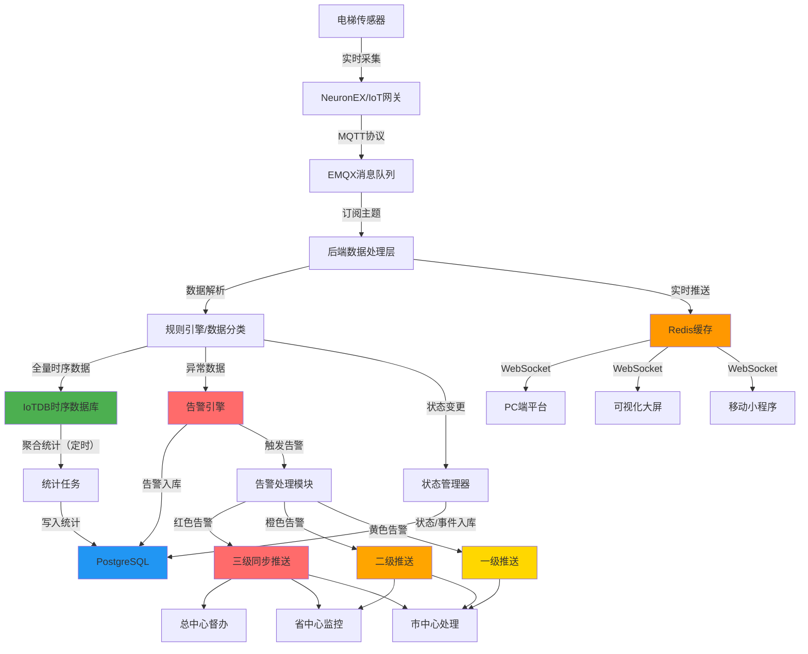
```mermaid
graph TB
    A[电梯传感器] -->|实时采集| B[NeuronEX/IoT网关]
    B -->|MQTT协议| C[EMQX消息队列]
    
    C -->|订阅主题| D[后端数据处理层]
    
    D -->|数据解析| E[规则引擎/数据分类]
    E -->|全量时序数据| F[IoTDB时序数据库]
    E -->|异常数据| G[告警引擎]
    E -->|状态变更| S[状态管理器]
    
    G -->|告警入库| PG[PostgreSQL]
    S -->|状态/事件入库| PG
    F -->|聚合统计（定时）| T[统计任务]
    T -->|写入统计| PG
    
    D -->|实时推送| R[Redis缓存]
    G -->|触发告警| I[告警处理模块]
    
    I -->|红色告警| J[三级同步推送]
    I -->|橙色告警| K[二级推送]
    I -->|黄色告警| L[一级推送]
    
    J --> M[总中心督办]
    J --> N[省中心监控]
    J --> O[市中心处理]
    
    K --> N
    K --> O
    
    L --> O
    
    R -->|WebSocket| P[PC端平台]
    R -->|WebSocket| Q[可视化大屏]
    R -->|WebSocket| X[移动小程序]
    
    style G fill:#ff6b6b
    style J fill:#ff6b6b
    style K fill:#ffa500
    style L fill:#ffd700
    style F fill:#4CAF50
    style PG fill:#2196F3
    style R fill:#FF9800
```

### 1.3 数据格式示例

#### 设备上报数据（MQTT Topic）

```json
{
  "topic": "elevator/E1001/data",
  "payload": {
    "device_id": "E1001",
    "timestamp": 1704614400000,
    "floor": 12,
    "direction": "up",
    "door_status": "closed",
    "speed": 2.5,
    "load": 350,
    "temperature": 25,
    "vibration": 0.05,
    "power": 8.5
  }
}
```

#### 告警触发数据

```json
{
  "topic": "elevator/E1001/alert",
  "payload": {
    "device_id": "E1001",
    "alert_id": "ALT-20250106-001",
    "alert_level": "red",
    "alert_type": "trapped",
    "alert_desc": "困人告警",
    "timestamp": 1704614400000,
    "location": "南山区科技园A栋 6楼",
    "trapped_count": 6
  }
}
```

### 1.4 关键节点说明

| 节点 | 说明 | 处理时间 | 技术实现 |
|------|------|---------|---------|
| **传感器采集** | 电梯运行参数实时采集 | 实时（1秒/次） | 硬件传感器 |
| **NeuronEX/IoT网关** | 数据预处理与协议转换 | <100ms | Edge Computing |
| **EMQX传输** | 消息队列传输 | <50ms | MQTT QoS1 |
| **规则引擎** | 数据解析与告警判断 | <100ms | 复杂事件处理(CEP) |
| **数据存储** | 分层存储：时序→IoTDB；告警/状态/业务→PostgreSQL；热数据→Redis | <50ms | IoTDB + PostgreSQL + Redis |
| **告警推送** | 实时推送到三端 | <200ms | WebSocket/极光推送 |

### 1.5 异常处理机制

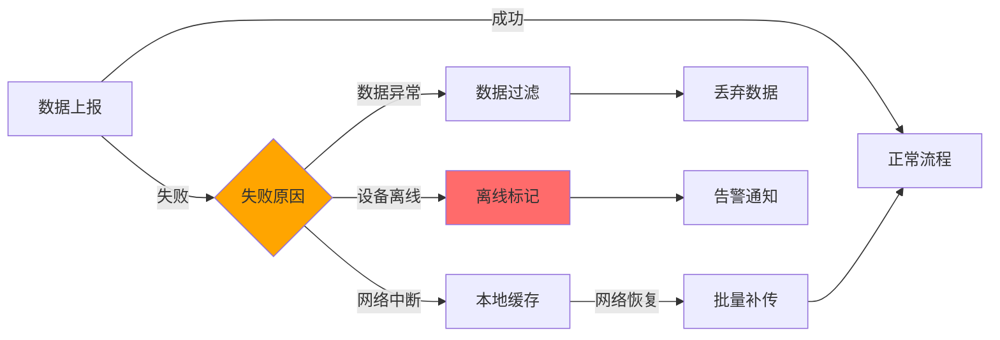
```mermaid
graph LR
    A[数据上报] -->|成功| B[正常流程]
    A -->|失败| C{失败原因}
    
    C -->|网络中断| D[本地缓存]
    C -->|数据异常| E[数据过滤]
    C -->|设备离线| F[离线标记]
    
    D -->|网络恢复| G[批量补传]
    E --> H[丢弃数据]
    F --> I[告警通知]
    
    G --> B
    
    style C fill:#ffa500
    style F fill:#ff6b6b
```

---

## 二、告警处理流程

### 2.1 告警分级标准

| 级别 | 颜色 | 条件 | 响应时间 | 处理角色 |
|------|------|------|---------|---------|
| **红色** | 🔴 | 困人、冲顶、坠梯、火灾 | 30分钟 | 市中心立即响应 |
| **橙色** | 🟠 | 门故障、制动器异常、钢丝绳磨损 | 2小时 | 市中心转工单 |
| **黄色** | 🟡 | 温度偏高、噪音异常、振动超标 | 4小时 | 市中心巡检处理 |

### 2.2 红色告警（困人）完整流程

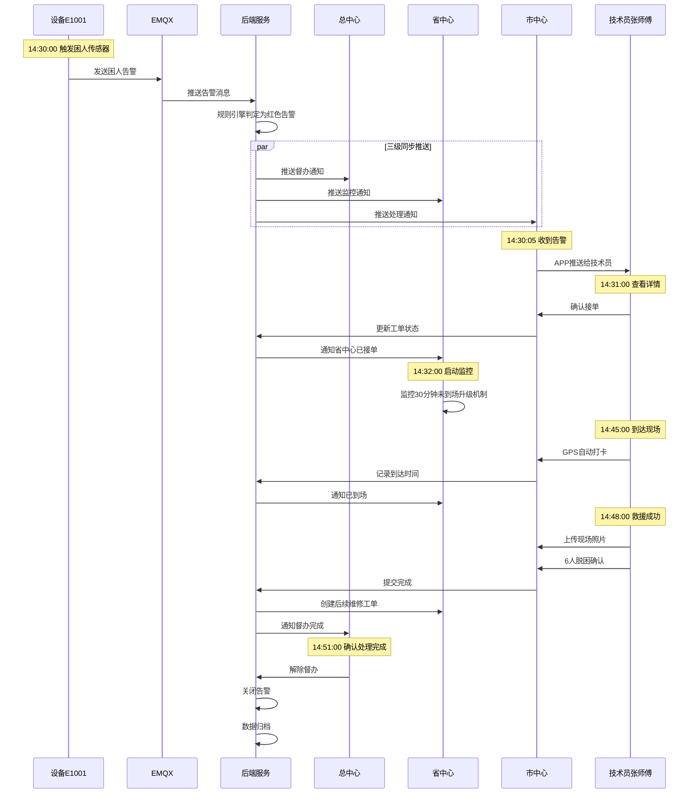
```mermaid
sequenceDiagram
    participant D as 设备E1001
    participant E as EMQX
    participant B as 后端服务
    participant T as 总中心
    participant P as 省中心
    participant C as 市中心
    participant Tech as 技术员张师傅
    
    Note over D: 14:30:00 触发困人传感器
    D->>E: 发送困人告警
    E->>B: 推送告警消息
    B->>B: 规则引擎判定为红色告警
    
    par 三级同步推送
        B->>T: 推送督办通知
        B->>P: 推送监控通知
        B->>C: 推送处理通知
    end
    
    Note over C: 14:30:05 收到告警
    C->>Tech: APP推送给技术员
    
    Note over Tech: 14:31:00 查看详情
    Tech->>C: 确认接单
    C->>B: 更新工单状态
    B->>P: 通知省中心已接单
    
    Note over P: 14:32:00 启动监控
    P->>P: 监控30分钟未到场升级机制
    
    Note over Tech: 14:45:00 到达现场
    Tech->>C: GPS自动打卡
    C->>B: 记录到达时间
    B->>P: 通知已到场
    
    Note over Tech: 14:48:00 救援成功
    Tech->>C: 上传现场照片
    Tech->>C: 6人脱困确认
    C->>B: 提交完成
    
    B->>P: 创建后续维修工单
    B->>T: 通知督办完成
    
    Note over T: 14:51:00 确认处理完成
    T->>B: 解除督办
    B->>B: 关闭告警
    B->>B: 数据归档
```

### 2.3 橙色告警（门故障）流程

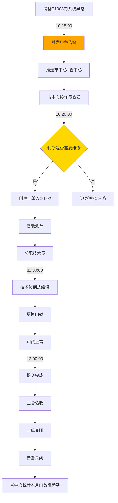
```mermaid
graph TB
    A[设备E1008门系统异常] -->|10:15:00| B[触发橙色告警]
    B --> C[推送市中心+省中心]
    C --> D[市中心操作员查看]
    
    D -->|10:20:00| E{判断是否需要维修}
    E -->|是| F[创建工单WO-002]
    E -->|否| G[记录巡检/忽略]
    
    F --> H[智能派单]
    H --> I[分配技术员]
    
    I -->|11:30:00| J[技术员到达维修]
    J --> K[更换门锁]
    K --> L[测试正常]
    
    L -->|12:00:00| M[提交完成]
    M --> N[主管验收]
    N --> O[工单关闭]
    O --> P[告警关闭]
    
    P --> Q[省中心统计本月门故障趋势]
    
    style B fill:#ffa500
    style E fill:#ffd700
```

### 2.4 黄色告警（温度异常）流程


```mermaid
graph LR
    A[设备E1023温度31°C] -->|08:00:00| B[触发黄色告警]
    B --> C[仅推送市中心]
    C --> D[市中心批量处理]
    
    D -->|09:00:00| E[安排下午巡检]
    E -->|14:00:00| F[技术员巡检]
    F --> G[检查通风系统]
    G --> H[清理散热口]
    
    H -->|14:30:00| I[温度恢复正常]
    I --> J[告警关闭]
    J --> K[记录维保日志]
    
    style B fill:#ffd700
```

### 2.5 告警升级机制

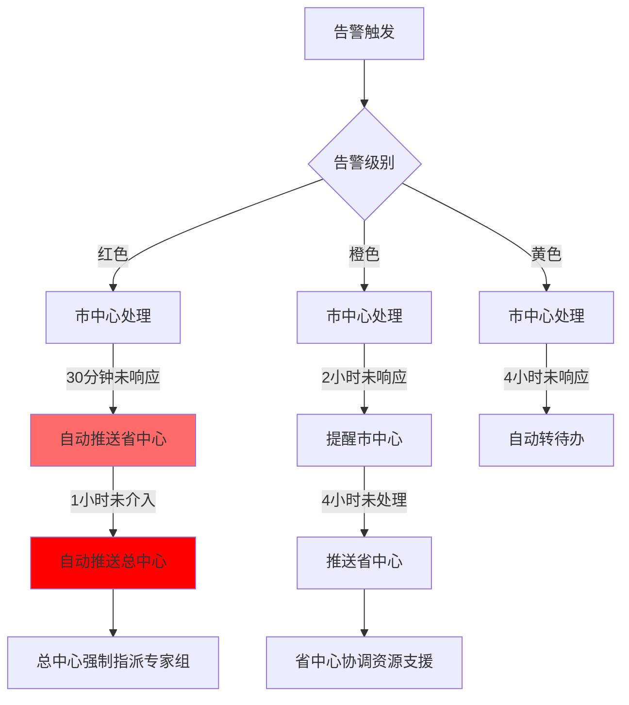
```mermaid
graph TB
    A[告警触发] --> B{告警级别}
    
    B -->|红色| C[市中心处理]
    B -->|橙色| D[市中心处理]
    B -->|黄色| E[市中心处理]
    
    C -->|30分钟未响应| F[自动推送省中心]
    D -->|2小时未响应| G[提醒市中心]
    E -->|4小时未响应| H[自动转待办]
    
    F -->|1小时未介入| I[自动推送总中心]
    G -->|4小时未处理| J[推送省中心]
    
    I --> K[总中心强制指派专家组]
    J --> L[省中心协调资源支援]
    
    style F fill:#ff6b6b
    style I fill:#ff0000
```

### 2.6 告警统计分析

#### 统计维度

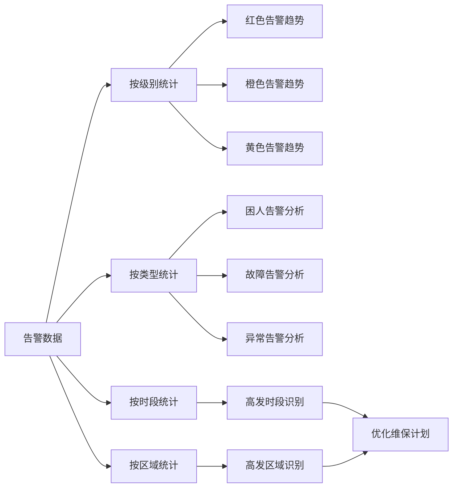
```mermaid
graph LR
    A[告警数据] --> B[按级别统计]
    A --> C[按类型统计]
    A --> D[按时段统计]
    A --> E[按区域统计]
    
    B --> F[红色告警趋势]
    B --> G[橙色告警趋势]
    B --> H[黄色告警趋势]
    
    C --> I[困人告警分析]
    C --> J[故障告警分析]
    C --> K[异常告警分析]
    
    D --> L[高发时段识别]
    E --> M[高发区域识别]
    
    L --> N[优化维保计划]
    M --> N
```

---

## 三、工单处理全流程

### 3.1 工单生命周期

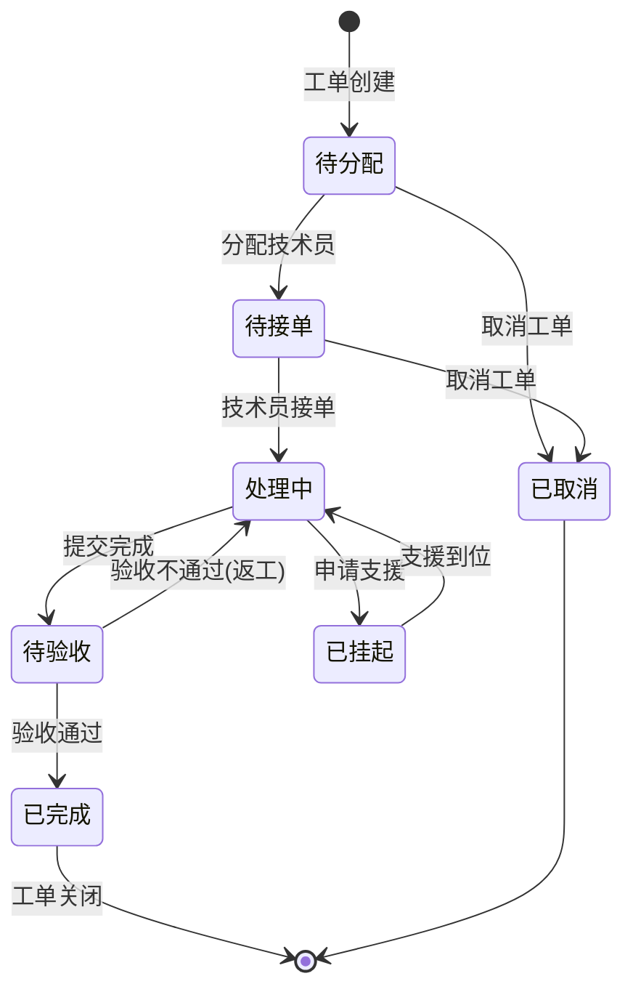
```mermaid
stateDiagram-v2
    [*] --> 待分配: 工单创建
    待分配 --> 待接单: 分配技术员
    待接单 --> 处理中: 技术员接单
    处理中 --> 待验收: 提交完成
    待验收 --> 已完成: 验收通过
    待验收 --> 处理中: 验收不通过(返工)
    已完成 --> [*]: 工单关闭
    
    待分配 --> 已取消: 取消工单
    待接单 --> 已取消: 取消工单
    已取消 --> [*]
    
    处理中 --> 已挂起: 申请支援
    已挂起 --> 处理中: 支援到位
```

### 3.2 工单创建流程

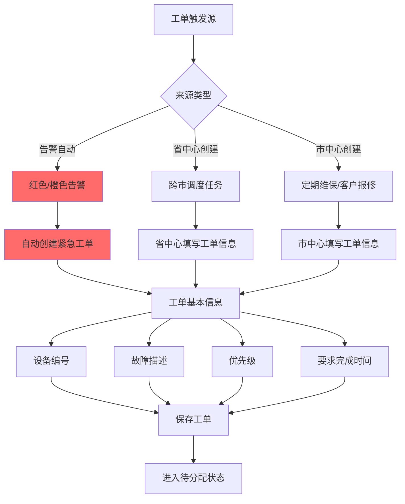
```mermaid
graph TB
    A[工单触发源] --> B{来源类型}
    
    B -->|告警自动| C[红色/橙色告警]
    B -->|省中心创建| D[跨市调度任务]
    B -->|市中心创建| E[定期维保/客户报修]
    
    C --> F[自动创建紧急工单]
    D --> G[省中心填写工单信息]
    E --> H[市中心填写工单信息]
    
    F --> I[工单基本信息]
    G --> I
    H --> I
    
    I --> J[设备编号]
    I --> K[故障描述]
    I --> L[优先级]
    I --> M[要求完成时间]
    
    J --> N[保存工单]
    K --> N
    L --> N
    M --> N
    
    N --> O[进入待分配状态]
    
    style C fill:#ff6b6b
    style F fill:#ff6b6b
```

### 3.3 智能派单流程

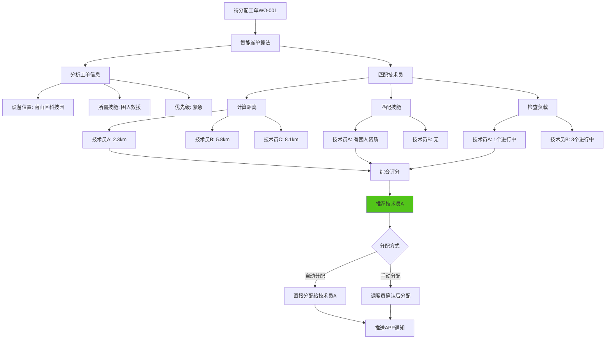
```mermaid
graph TB
    A[待分配工单WO-001] --> B[智能派单算法]
    
    B --> C[分析工单信息]
    C --> D[设备位置: 南山区科技园]
    C --> E[所需技能: 困人救援]
    C --> F[优先级: 紧急]
    
    B --> G[匹配技术员]
    G --> H[计算距离]
    G --> I[匹配技能]
    G --> J[检查负载]
    
    H --> K[技术员A: 2.3km]
    H --> L[技术员B: 5.8km]
    H --> M[技术员C: 8.1km]
    
    I --> N[技术员A: 有困人资质]
    I --> O[技术员B: 无]
    
    J --> P[技术员A: 1个进行中]
    J --> Q[技术员B: 3个进行中]
    
    K --> R[综合评分]
    N --> R
    P --> R
    
    R --> S[推荐技术员A]
    S --> T{分配方式}
    
    T -->|自动分配| U[直接分配给技术员A]
    T -->|手动分配| V[调度员确认后分配]
    
    U --> W[推送APP通知]
    V --> W
    
    style S fill:#52c41a
```

### 3.4 工单执行流程

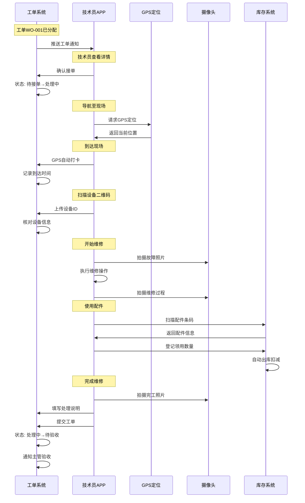
```mermaid
sequenceDiagram
    participant W as 工单系统
    participant A as 技术员APP
    participant G as GPS定位
    participant C as 摄像头
    participant I as 库存系统
    
    Note over W: 工单WO-001已分配
    W->>A: 推送工单通知
    
    Note over A: 技术员查看详情
    A->>W: 确认接单
    W->>W: 状态: 待接单→处理中
    
    Note over A: 导航至现场
    A->>G: 请求GPS定位
    G->>A: 返回当前位置
    
    Note over A: 到达现场
    A->>W: GPS自动打卡
    W->>W: 记录到达时间
    
    Note over A: 扫描设备二维码
    A->>W: 上传设备ID
    W->>W: 核对设备信息
    
    Note over A: 开始维修
    A->>C: 拍摄故障照片
    A->>A: 执行维修操作
    A->>C: 拍摄维修过程
    
    Note over A: 使用配件
    A->>I: 扫描配件条码
    I->>A: 返回配件信息
    A->>I: 登记领用数量
    I->>I: 自动出库扣减
    
    Note over A: 完成维修
    A->>C: 拍摄完工照片
    A->>W: 填写处理说明
    A->>W: 提交工单
    
    W->>W: 状态: 处理中→待验收
    W->>W: 通知主管验收
```

### 3.5 工单验收流程

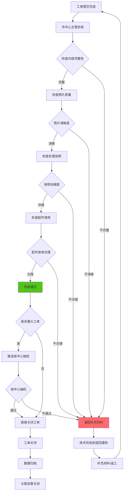
```mermaid
graph TB
    A[工单提交完成] --> B[市中心主管验收]
    
    B --> C{检查内容完整性}
    C -->|完整| D[检查照片质量]
    C -->|不完整| E[退回补充材料]
    
    D --> F{照片清晰度}
    F -->|清晰| G[检查处理说明]
    F -->|不清晰| E
    
    G --> H{说明详细度}
    H -->|详细| I[检查配件使用]
    H -->|不详细| E
    
    I --> J{配件使用合理}
    J -->|合理| K[验收通过]
    J -->|不合理| E
    
    K --> L{是否重大工单}
    L -->|是| M[推送省中心抽检]
    L -->|否| N[直接关闭工单]
    
    M --> O{省中心抽检}
    O -->|通过| N
    O -->|不通过| E
    
    E --> P[技术员收到退回通知]
    P --> Q[补充材料/返工]
    Q --> A
    
    N --> R[工单关闭]
    R --> S[数据归档]
    S --> T[关联告警关闭]
    
    style K fill:#52c41a
    style E fill:#ff6b6b
```

### 3.6 工单统计分析

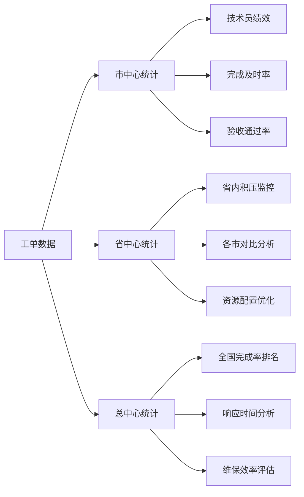
```mermaid
graph LR
    A[工单数据] --> B[市中心统计]
    A --> C[省中心统计]
    A --> D[总中心统计]
    
    B --> E[技术员绩效]
    B --> F[完成及时率]
    B --> G[验收通过率]
    
    C --> H[省内积压监控]
    C --> I[各市对比分析]
    C --> J[资源配置优化]
    
    D --> K[全国完成率排名]
    D --> L[响应时间分析]
    D --> M[维保效率评估]
```

---

## 四、备品备件调拨流程

### 4.1 三级库存架构

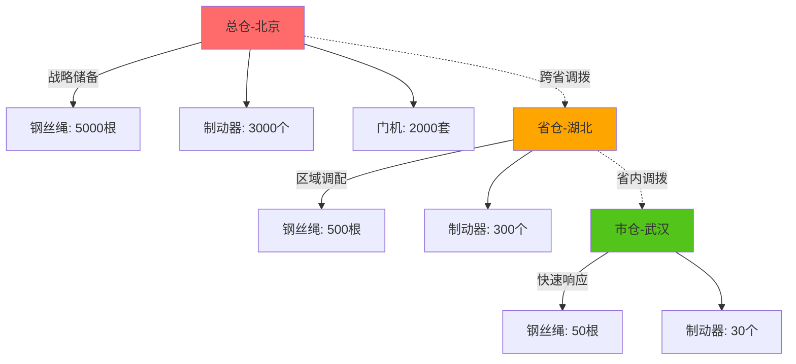
```mermaid
graph TB
    A[总仓-北京] -->|战略储备| B[钢丝绳: 5000根]
    A --> C[制动器: 3000个]
    A --> D[门机: 2000套]
    
    E[省仓-湖北] -->|区域调配| F[钢丝绳: 500根]
    E --> G[制动器: 300个]
    
    H[市仓-武汉] -->|快速响应| I[钢丝绳: 50根]
    H --> J[制动器: 30个]
    
    A -.跨省调拨.-> E
    E -.省内调拨.-> H
    
    style A fill:#ff6b6b
    style E fill:#ffa500
    style H fill:#52c41a
```

### 4.2 低库存触发调拨流程

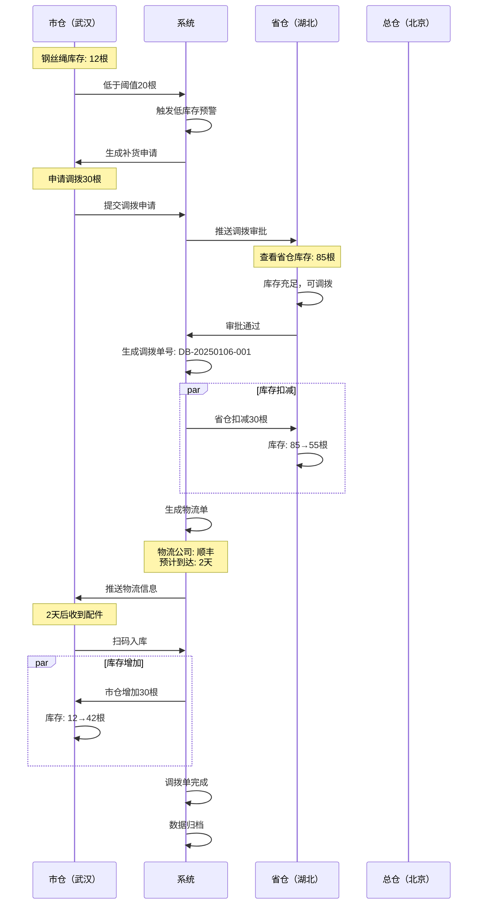
```mermaid
sequenceDiagram
    participant MC as 市仓（武汉）
    participant SYS as 系统
    participant PC as 省仓（湖北）
    participant NC as 总仓（北京）
    
    Note over MC: 钢丝绳库存: 12根
    MC->>SYS: 低于阈值20根
    SYS->>SYS: 触发低库存预警
    
    SYS->>MC: 生成补货申请
    Note over MC: 申请调拨30根
    MC->>SYS: 提交调拨申请
    
    SYS->>PC: 推送调拨审批
    Note over PC: 查看省仓库存: 85根
    PC->>PC: 库存充足，可调拨
    
    PC->>SYS: 审批通过
    SYS->>SYS: 生成调拨单号: DB-20250106-001
    
    par 库存扣减
        SYS->>PC: 省仓扣减30根
        PC->>PC: 库存: 85→55根
    end
    
    SYS->>SYS: 生成物流单
    Note over SYS: 物流公司: 顺丰<br/>预计到达: 2天
    
    SYS->>MC: 推送物流信息
    
    Note over MC: 2天后收到配件
    MC->>SYS: 扫码入库
    
    par 库存增加
        SYS->>MC: 市仓增加30根
        MC->>MC: 库存: 12→42根
    end
    
    SYS->>SYS: 调拨单完成
    SYS->>SYS: 数据归档
```

### 4.3 省仓库存不足时的流程

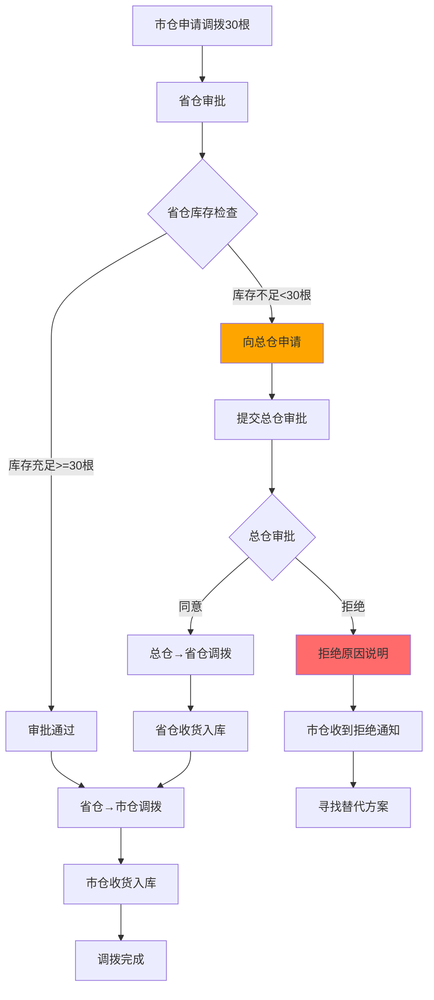
```mermaid
graph TB
    A[市仓申请调拨30根] --> B[省仓审批]
    B --> C{省仓库存检查}
    
    C -->|库存充足>=30根| D[审批通过]
    C -->|库存不足<30根| E[向总仓申请]
    
    D --> F[省仓→市仓调拨]
    
    E --> G[提交总仓审批]
    G --> H{总仓审批}
    
    H -->|同意| I[总仓→省仓调拨]
    H -->|拒绝| J[拒绝原因说明]
    
    I --> K[省仓收货入库]
    K --> F
    
    J --> L[市仓收到拒绝通知]
    L --> M[寻找替代方案]
    
    F --> N[市仓收货入库]
    N --> O[调拨完成]
    
    style E fill:#ffa500
    style J fill:#ff6b6b
```

### 4.4 工单配件出库流程

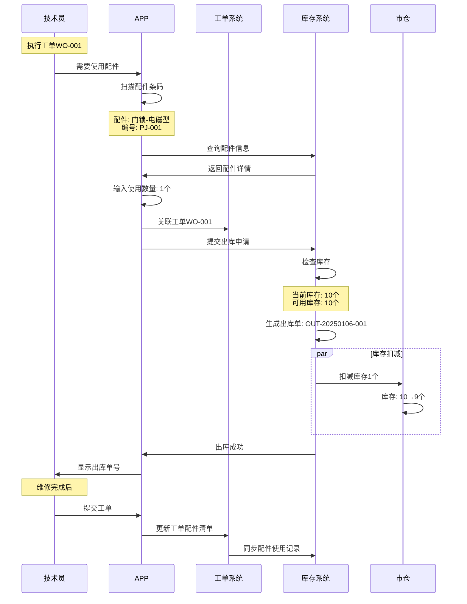
```mermaid
sequenceDiagram
    participant T as 技术员
    participant A as APP
    participant W as 工单系统
    participant I as 库存系统
    participant WH as 市仓
    
    Note over T: 执行工单WO-001
    T->>A: 需要使用配件
    
    A->>A: 扫描配件条码
    Note over A: 配件: 门锁-电磁型<br/>编号: PJ-001
    
    A->>I: 查询配件信息
    I->>A: 返回配件详情
    
    A->>A: 输入使用数量: 1个
    A->>W: 关联工单WO-001
    
    A->>I: 提交出库申请
    
    I->>I: 检查库存
    Note over I: 当前库存: 10个<br/>可用库存: 10个
    
    I->>I: 生成出库单: OUT-20250106-001
    
    par 库存扣减
        I->>WH: 扣减库存1个
        WH->>WH: 库存: 10→9个
    end
    
    I->>A: 出库成功
    A->>T: 显示出库单号
    
    Note over T: 维修完成后
    T->>A: 提交工单
    A->>W: 更新工单配件清单
    W->>I: 同步配件使用记录
```

### 4.5 盘点流程

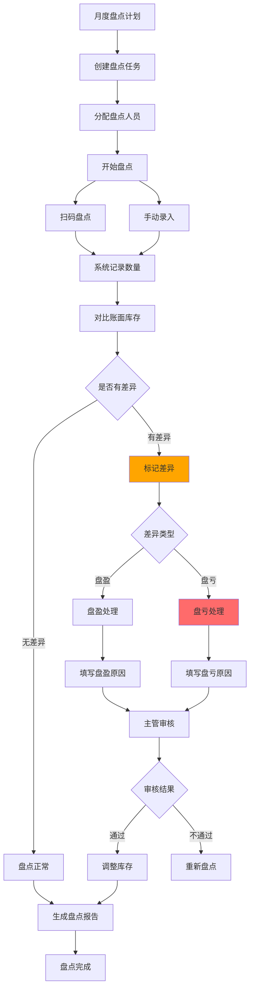
```mermaid
graph TB
    A[月度盘点计划] --> B[创建盘点任务]
    B --> C[分配盘点人员]
    
    C --> D[开始盘点]
    D --> E[扫码盘点]
    D --> F[手动录入]
    
    E --> G[系统记录数量]
    F --> G
    
    G --> H[对比账面库存]
    H --> I{是否有差异}
    
    I -->|无差异| J[盘点正常]
    I -->|有差异| K[标记差异]
    
    K --> L{差异类型}
    L -->|盘盈| M[盘盈处理]
    L -->|盘亏| N[盘亏处理]
    
    M --> O[填写盘盈原因]
    N --> P[填写盘亏原因]
    
    O --> Q[主管审核]
    P --> Q
    
    Q --> R{审核结果}
    R -->|通过| S[调整库存]
    R -->|不通过| T[重新盘点]
    
    S --> U[生成盘点报告]
    J --> U
    
    U --> V[盘点完成]
    
    style K fill:#ffa500
    style N fill:#ff6b6b
```

---

## 五、维保执行流程

### 5.1 定期维保流程

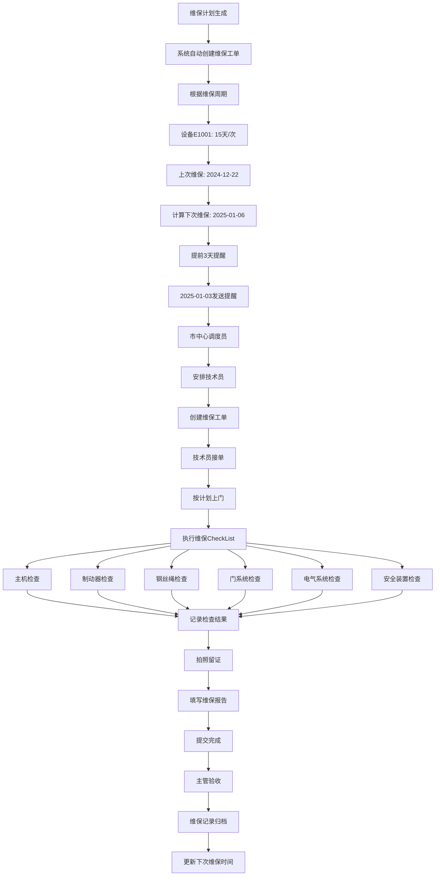
```mermaid
graph TB
    A[维保计划生成] --> B[系统自动创建维保工单]
    B --> C[根据维保周期]
    C --> D[设备E1001: 15天/次]
    
    D --> E[上次维保: 2024-12-22]
    E --> F[计算下次维保: 2025-01-06]
    
    F --> G[提前3天提醒]
    G --> H[2025-01-03发送提醒]
    
    H --> I[市中心调度员]
    I --> J[安排技术员]
    J --> K[创建维保工单]
    
    K --> L[技术员接单]
    L --> M[按计划上门]
    
    M --> N[执行维保CheckList]
    N --> O[主机检查]
    N --> P[制动器检查]
    N --> Q[钢丝绳检查]
    N --> R[门系统检查]
    N --> S[电气系统检查]
    N --> T[安全装置检查]
    
    O --> U[记录检查结果]
    P --> U
    Q --> U
    R --> U
    S --> U
    T --> U
    
    U --> V[拍照留证]
    V --> W[填写维保报告]
    W --> X[提交完成]
    
    X --> Y[主管验收]
    Y --> Z[维保记录归档]
    Z --> AA[更新下次维保时间]
```

### 5.2 维保CheckList

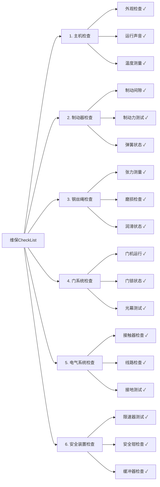
```mermaid
graph LR
    A[维保CheckList] --> B[1. 主机检查]
    A --> C[2. 制动器检查]
    A --> D[3. 钢丝绳检查]
    A --> E[4. 门系统检查]
    A --> F[5. 电气系统检查]
    A --> G[6. 安全装置检查]
    
    B --> B1[外观检查 ✓]
    B --> B2[运行声音 ✓]
    B --> B3[温度测量 ✓]
    
    C --> C1[制动间隙 ✓]
    C --> C2[制动力测试 ✓]
    C --> C3[弹簧状态 ✓]
    
    D --> D1[张力测量 ✓]
    D --> D2[磨损检查 ✓]
    D --> D3[润滑状态 ✓]
    
    E --> E1[门机运行 ✓]
    E --> E2[门锁状态 ✓]
    E --> E3[光幕测试 ✓]
    
    F --> F1[接触器检查 ✓]
    F --> F2[线路检查 ✓]
    F --> F3[接地测试 ✓]
    
    G --> G1[限速器测试 ✓]
    G --> G2[安全钳检查 ✓]
    G --> G3[缓冲器检查 ✓]
```

### 5.3 故障维保流程

```mermaid
sequenceDiagram
    participant A as 告警系统
    participant W as 工单系统
    participant D as 调度员
    participant T as 技术员
    participant I as 库存系统
    
    Note over A: 设备E1008门故障
    A->>W: 自动创建紧急工单
    W->>W: 工单WO-002<br/>优先级: 重要
    
    W->>D: 推送待分配工单
    D->>D: 查看工单详情
    D->>D: 智能派单推荐技术员
    D->>W: 分配给技术员B
    
    W->>T: APP推送工单
    T->>W: 接单
    
    Note over T: 导航前往
    T->>W: GPS打卡到达
    
    T->>T: 扫码签到
    T->>T: 故障诊断
    Note over T: 门锁损坏需更换
    
    T->>I: 扫码领用门锁
    I->>I: 出库扣减库存
    I->>T: 出库成功
    
    T->>T: 更换门锁
    T->>T: 测试门开关
    T->>T: 拍照记录
    
    T->>W: 提交工单
    Note over W: 状态: 待验收
    
    W->>D: 推送验收通知
    D->>W: 查看照片和说明
    D->>W: 验收通过
    
    W->>W: 工单关闭
    W->>A: 关联告警关闭
```

---

## 六、跨区协调流程

### 6.1 跨市技术支援流程

```mermaid
graph TB
    A[武汉市发生4起困人] --> B[市内3个技术员全部出动]
    B --> C[新增第4起困人告警]
    
    C --> D[市中心系统检测]
    D --> E{本市是否有可用资源}
    
    E -->|无| F[自动上报省中心]
    E -->|有| G[市内调度]
    
    F --> H[省中心调度系统]
    H --> I[查询相邻市资源]
    I --> J[洪山区技术员空闲]
    
    J --> K[省中心调度决策]
    K --> L[协调洪山区技术员支援]
    
    L --> M[推送跨区工单]
    M --> N[技术员接单]
    N --> O[导航至武汉现场]
    
    O --> P[执行救援]
    P --> Q[工单完成]
    
    Q --> R[费用结算]
    R --> S[武汉市统一结算]
    
    S --> T[省中心记录调度]
    T --> U[纳入月度考核]
    
    style F fill:#ffa500
    style L fill:#52c41a
```

### 6.2 跨市配件调拨流程

```mermaid
sequenceDiagram
    participant W as 武汉市仓
    participant P as 省中心
    participant Y as 宜昌市仓
    
    Note over W: 急需制动器5个<br/>本市库存: 0个
    W->>P: 紧急申请调拨
    
    P->>P: 查询省内各市库存
    Note over P: 武汉: 0个<br/>宜昌: 15个<br/>襄阳: 8个
    
    P->>Y: 查询宜昌可调拨数量
    Y->>P: 确认可调拨5个
    
    P->>P: 审批通过
    P->>W: 通知从宜昌调拨
    P->>Y: 下发调拨指令
    
    Y->>Y: 打包配件
    Y->>Y: 生成物流单
    
    Note over Y: 同城速运<br/>预计6小时到达
    
    Y->>P: 上传物流信息
    P->>W: 推送物流跟踪
    
    Note over W: 6小时后
    W->>W: 收货确认
    W->>P: 入库完成
    
    P->>P: 更新双方库存
    P->>P: 费用结算
```

### 6.3 省级专家调度流程

```mermaid
graph TB
    A[某市复杂故障] --> B[市中心技术员无法处理]
    B --> C[申请省级专家支援]
    
    C --> D[省中心接收申请]
    D --> E[查看故障描述]
    E --> F{故障复杂度评估}
    
    F -->|一般| G[安排省内高级技术员]
    F -->|复杂| H[申请总中心专家组]
    
    G --> I[省内专家接单]
    I --> J[前往现场支援]
    
    H --> K[总中心专家评估]
    K --> L[派遣专家组]
    L --> M[携带专业设备]
    M --> J
    
    J --> N[现场诊断]
    N --> O[制定方案]
    O --> P[指导维修]
    
    P --> Q[故障解决]
    Q --> R[技术报告]
    R --> S[经验总结]
    S --> T[知识库录入]
    
    style H fill:#ff6b6b
    style L fill:#ff6b6b
```

---

## 七、三级权限数据流转

### 7.1 数据上报流程

```mermaid
graph TB
    A[市维保中心-武汉] -->|实时数据| B[市级数据库]
    B -->|汇总| C[省运营中心-湖北]
    C -->|汇总| D[总数据中心-北京]
    
    B -->|实时推送| E[市中心平台]
    C -->|定时同步| F[省中心平台]
    D -->|批量汇总| G[总中心平台]
    
    E --> H[市中心操作员]
    F --> I[省中心管理员]
    G --> J[总中心决策层]
    
    H -->|工单数据| K[日报]
    I -->|统计数据| L[周报/月报]
    J -->|分析数据| M[季报/年报]
    
    style A fill:#52c41a
    style C fill:#ffa500
    style D fill:#ff6b6b
```

### 7.2 指令下发流程

```mermaid
graph TB
    A[总数据中心决策] --> B[发布全国政策]
    B --> C[告警阈值调整]
    B --> D[节能目标设定]
    B --> E[考核标准制定]
    
    C --> F[省中心接收]
    D --> F
    E --> F
    
    F --> G[省内执行方案]
    G --> H[市中心接收]
    
    H --> I[市级实施细则]
    I --> J[技术员执行]
    
    J --> K[执行反馈]
    K --> H
    H --> L[市级反馈]
    L --> F
    F --> M[省级总结]
    M --> A
    
    style A fill:#ff6b6b
    style F fill:#ffa500
    style H fill:#52c41a
```

### 7.3 数据查询权限

```mermaid
graph LR
    A[用户登录] --> B{识别角色}
    
    B -->|总中心| C[查询全国数据]
    B -->|省中心| D[查询省内数据]
    B -->|市中心| E[查询市内数据]
    
    C --> F[WHERE 1=1]
    D --> G[WHERE province='湖北']
    E --> H[WHERE province='湖北' AND city='武汉']
    
    F --> I[返回全量结果]
    G --> J[返回省内结果]
    H --> K[返回市内结果]
```

---

## 八、用户登录与权限验证

### 8.1 用户登录流程

```mermaid
sequenceDiagram
    participant U as 用户
    participant F as 前端
    participant B as 后端
    participant DB as 数据库
    participant R as Redis
    
    U->>F: 输入用户名密码
    F->>F: 前端验证
    F->>B: POST /api/login
    
    B->>DB: 查询用户信息
    DB->>B: 返回用户数据
    
    B->>B: 验证密码
    alt 密码正确
        B->>B: 生成JWT Token
        B->>R: 缓存用户会话
        B->>F: 返回Token+用户信息
        F->>F: 存储Token
        F->>U: 跳转到首页
    else 密码错误
        B->>F: 返回错误信息
        F->>U: 显示错误提示
    end
```

### 8.2 权限验证流程

```mermaid
graph TB
    A[用户请求] --> B[前端拦截器]
    B --> C{是否有Token}
    
    C -->|无| D[跳转登录页]
    C -->|有| E[发送请求+Token]
    
    E --> F[后端拦截器]
    F --> G{验证Token}
    
    G -->|无效| H[返回401]
    G -->|有效| I[解析用户信息]
    
    I --> J{检查功能权限}
    J -->|无权限| K[返回403]
    J -->|有权限| L{检查数据权限}
    
    L -->|无权限| K
    L -->|有权限| M[执行业务逻辑]
    
    M --> N[添加数据过滤]
    N --> O[执行SQL查询]
    O --> P[返回结果]
    
    H --> Q[前端跳转登录]
    K --> R[前端提示无权限]
    P --> S[前端渲染数据]
    
    style H fill:#ff6b6b
    style K fill:#ffa500
```

### 8.3 数据权限过滤

```mermaid
graph TB
    A[用户角色] --> B{识别数据范围}
    
    B -->|总中心管理员| C[data_scope: national]
    B -->|省中心管理员| D[data_scope: province]
    B -->|市中心操作员| E[data_scope: city]
    
    C --> F[SQL: WHERE 1=1]
    D --> G[SQL: WHERE province = ?]
    E --> H[SQL: WHERE province = ? AND city = ?]
    
    F --> I[查询全国数据]
    G --> J[查询省内数据]
    H --> K[查询市内数据]
    
    I --> L[返回结果集]
    J --> L
    K --> L
```

---

## 附录A：关键时效指标

| 业务类型 | 响应时间 | 到达时间 | 完成时间 | 超时处理 |
|---------|---------|---------|---------|---------|
| **红色告警-困人** | 30分钟 | 60分钟 | 120分钟 | 自动升级省中心 |
| **橙色告警-门故障** | 120分钟 | 240分钟 | 480分钟 | 4小时升级 |
| **黄色告警-温度异常** | 240分钟 | 480分钟 | 1440分钟 | 8小时提醒 |
| **定期维保** | 提前3天 | 按计划 | 2小时 | 延期需审批 |
| **紧急工单** | 30分钟 | 60分钟 | 4小时 | 自动升级 |
| **一般工单** | 2小时 | 4小时 | 8小时 | 督办提醒 |

## 附录B：MQTT主题设计

```
电梯数据主题结构:
├── elevator/{device_id}/data          # 实时运行数据
├── elevator/{device_id}/alert         # 告警消息
├── elevator/{device_id}/control       # 远程控制指令
├── elevator/{device_id}/status        # 状态变更
└── elevator/{device_id}/heartbeat     # 心跳包

订阅规则:
├── 后端服务: elevator/+/data          # 订阅所有设备数据
├── 后端服务: elevator/+/alert         # 订阅所有设备告警
└── 单设备监控: elevator/E1001/#       # 订阅单设备所有主题
```

## 附录C：数据库表关联关系

```
核心表关联:
devices (设备表)
├── alerts (告警表) - FK: device_id
├── work_orders (工单表) - FK: device_id
├── maintenance_records (维保记录表) - FK: device_id
└── device_data (设备数据表) - FK: device_id

work_orders (工单表)
├── work_order_logs (工单日志表) - FK: work_order_id
├── work_order_photos (工单照片表) - FK: work_order_id
└── work_order_parts (工单配件表) - FK: work_order_id

inventory (库存表)
├── inventory_in (入库表) - FK: part_id
├── inventory_out (出库表) - FK: part_id
└── inventory_transfer (调拨表) - FK: part_id

users (用户表)
├── roles (角色表) - 多对多关联
└── organizations (组织表) - FK: org_id
```

---

**文档版本**: v1.0  
**创建日期**: 2025-01-06  
**文档状态**: ✅ 已完成  
**适用范围**: 全平台业务流程
